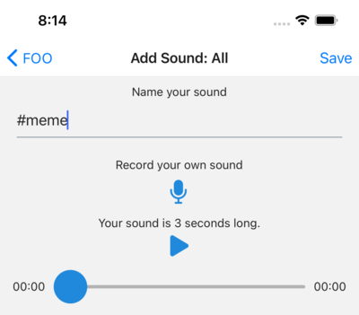

# Sonorous

A basic React Native app that lets you create soundboards with custom soundbites.

## About

This project came about from me wanting to experiment with Expo and React Native, along with some of its
support for audio recording and playback. Instead of the usual to-do list project, I figured I'd try
something _slightly_ more interesting that targets both iOS and Android.

Anyway, this app allows a user to create a soundboard, create one or more groups under that soundboard,
and record custom sounds using their device. These sounds can be saved and played back, for the ultimate
meme-inducing experience.

## Developing

This project uses the [Expo](https://expo.io) framework for scaffolding.

1. Make sure you install [Expo](https://docs.expo.io/get-started/installation/) and its related tooling
2. Run `npm install` in the root directory
3. Run `npm start` to bring up the Expo toolchain
4. Open the app on either an iOS Simulator or Android Emulator instance
